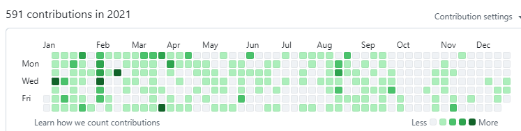
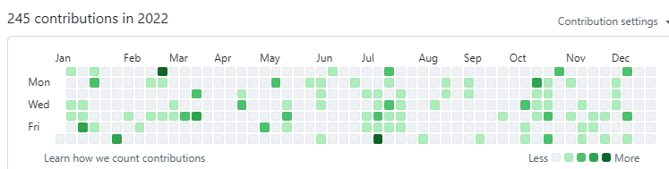
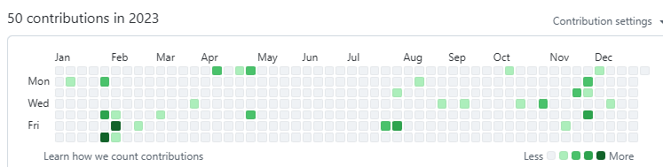
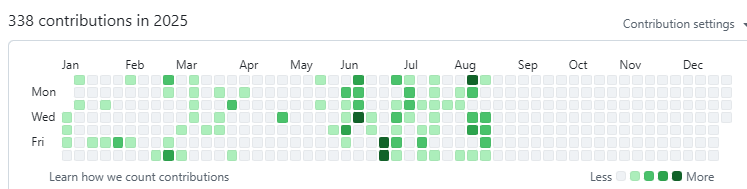

> Continuously regressing……, so sad！:cry:

### Hi there 👋

**veaba's blog**: [veaba.me](https://www.veaba.me)

  
  

  
  
  
  
  

- 🤔 I'm started job hunting.
- ✨ **Learning English...**
- 🔭 I'm a member of [Vuejs](https://github.com/vuejs) Chinese docs team.
- 🌱 I's currently focusing on the following tasks.
  - Chinese translation for v3.vuejs.org: [docs-next-zh-cn](https://github.com/vuejs/docs-next-zh-cn/).
  - A http proxy server of rust language (likeness Nginx) [Rusic](https://github.com/veaba/rustic).
  - Developing A personal blog.
  - Developing A note system,all system are operational.
  - Developing Some tools.

<!--
**veaba/veaba** is a ✨ _special_ ✨ repository because its `README.md` (this file) appears on your GitHub profile.

Here are some ideas to get you started:

- 🔭 I’m currently working on ...
- 🌱 I’m currently learning ...
- 👯 I’m looking to collaborate on ...
- 🤔 I’m looking for help with ...
- 💬 Ask me about ...
- 📫 How to reach me: ...
- 😄 Pronouns: ...
- ⚡ Fun fact: ...
-->
